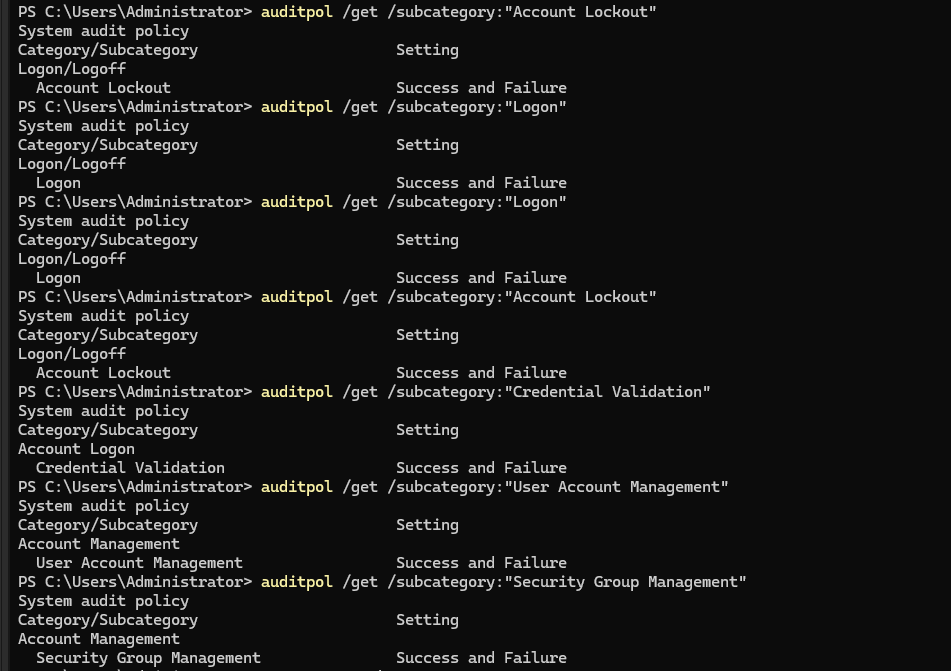
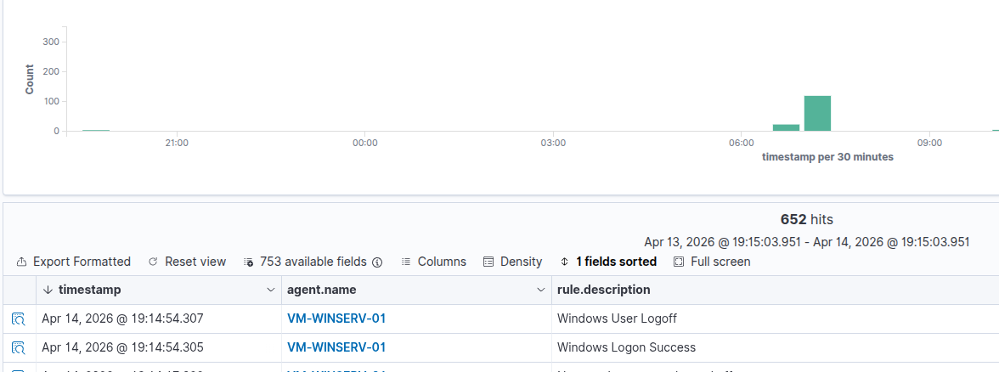
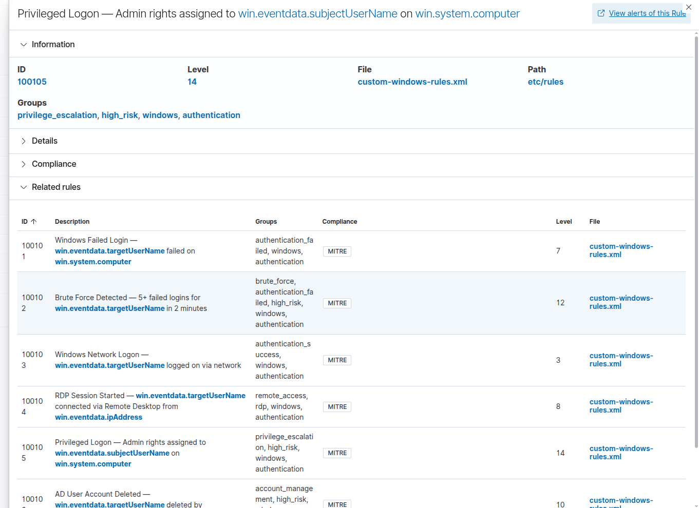
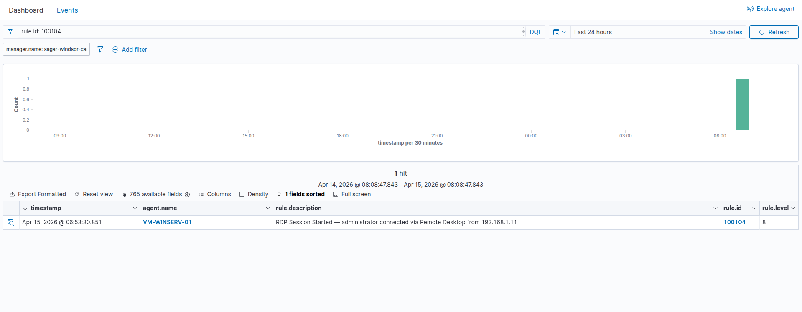
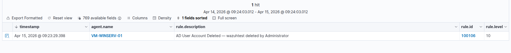
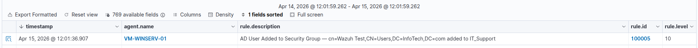
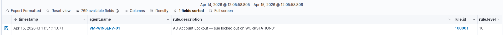
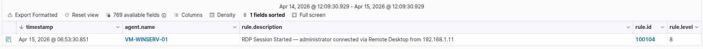

# 🛡️ Wazuh SIEM Lab — Security Monitoring on Windows Server 2025

> A fully operational Security Information and Event Management (SIEM) environment built on Wazuh — deployed on Ubuntu 25, monitoring two Windows Server 2025 Domain Controllers in real time.
> Detects, alerts on, and documents real security events generated by the Active Directory environment from the [AD & Windows Server Labs](https://github.com/your-username/ad-windows-server-labs) project.

<div align="center">


</div>

---

## 📌 Overview

Monitoring an IT environment is just as critical as building it. This project extends the [AD & Windows Server Labs](https://github.com/your-username/ad-windows-server-labs) environment by deploying a full SIEM stack — ingesting Windows Security Event logs from both Domain Controllers, writing custom detection rules for Active Directory threats, and documenting real incident detection cases.

**What this project demonstrates:**

- Deploying and configuring a production-grade SIEM from scratch
- Forwarding and parsing Windows Security Event logs in real time
- Writing custom alert rules for AD-specific threats
- Detecting, investigating, and documenting real security incidents
- The ability to monitor infrastructure proactively — not just react to user complaints

---

## 🖥️ Lab Environment

| Component          | Details                                            |
| ------------------ | -------------------------------------------------- |
| **SIEM Manager**   | Wazuh (Manager + Indexer + Dashboard) on Ubuntu 25 |
| **Ubuntu Host IP** | `192.168.1.xx`                                     |
| **Primary DC**     | `VM-DEV-WINSERV-01` — `192.168.1.10` — Wazuh Agent |
| **Secondary DC**   | `VM-DEV-WINSERV-02` — `192.168.1.12` — Wazuh Agent |
| **Domain**         | `InfoTech.com`                                     |
| **Virtualisation** | VMware Workstation Pro                             |
| **Network**        | Bridged — all machines on `192.168.1.0/24`         |

---

## 🏗️ Architecture

```
┌─────────────────────────────────────────────────┐
│              Ubuntu 25 Host (192.168.1.xx)      │
│                                                 │
│  ┌─────────────────────────────────────────┐   │
│  │           Wazuh Manager                 │   │
│  │      + Indexer (OpenSearch)             │   │
│  │      + Dashboard (Web UI :443)          │   │
│  │                                         │   │
│  │  Port 1514 ← agent events (TCP/UDP)    │   │
│  │  Port 1515 ← agent registration        │   │
│  │  Port  443 → dashboard (HTTPS)         │   │
│  └─────────────────────────────────────────┘   │
└──────────────────┬──────────────────────────────┘
                   │ encrypted traffic
          ┌────────┴────────┐
          ↓                 ↓
┌──────────────────┐  ┌──────────────────┐
│  VM-WINSERV-01   │  │  VM-WINSERV-02   │
│  192.168.1.10    │  │  192.168.1.12    │
│  Wazuh Agent     │  │  Wazuh Agent     │
│                  │  │                  │
│  Forwards:       │  │  Forwards:       │
│  • Security logs │  │  • Security logs │
│  • System logs   │  │  • System logs   │
│  • AD events     │  │  • AD events     │
└──────────────────┘  └──────────────────┘
```

---

## 📁 Repository Structure

```
wazuh-siem-lab/
│
├── config/
│   ├── ossec.conf                   # Wazuh manager main config ✅
│   ├── agent-winserv-01.conf        # Agent config — Server 01  ⏳
│   └── agent-winserv-02.conf        # Agent config — Server 02  ⏳
│
├── rules/
│   ├── custom-ad-rules.xml          # Custom rules — AD events   ✅
│   └── custom-windows-rules.xml     # Custom rules — Windows     ✅
│
├── alerts/
│   ├── account-lockout.md           # Detection case — lockout   ⏳
│   ├── failed-logins.md             # Detection case — brute force ⏳
│   └── privilege-escalation.md      # Detection case — group change ⏳
│
├── dashboards/
│   └── screenshots/                 # Wazuh dashboard screenshots ⏳
│
├── docs/
│   └── runbook.md                   # Operational runbook         ⏳
│
└── README.md
```

> ⏳ = In progress — being added as the project develops

---

## 🎯 Security Events Being Monitored

| Event ID | Description                  | Detection Goal                           |
| -------- | ---------------------------- | ---------------------------------------- |
| `4624`   | Successful logon             | Baseline + RDP detection (Logon Type 10) |
| `4625`   | Failed logon                 | Brute-force attack detection             |
| `4740`   | Account locked out           | Lockout alert + automated response       |
| `4767`   | Account unlocked             | Admin action audit trail                 |
| `4720`   | New user account created     | Unauthorised account creation            |
| `4728`   | User added to security group | Privilege escalation detection           |
| `4672`   | Admin privileges assigned    | Sensitive privilege monitoring           |
| `5136`   | AD object modified           | GPO and directory tampering              |

---

## 🧩 Build Progress

| #   | Phase                                       | Status      |
| --- | ------------------------------------------- | ----------- |
| 1   | Install Wazuh Manager on Ubuntu             | ✅ Complete |
| 2   | Access Wazuh Dashboard in browser           | ✅ Complete |
| 3   | Install Wazuh Agent on VM-WINSERV-01        | ✅ Complete |
| 4   | Install Wazuh Agent on VM-WINSERV-02        | ✅ Complete |
| 5   | Configure Windows Security Event forwarding | ✅ Complete |
| 6   | Verify events appearing in dashboard        | ✅ Complete |
| 7   | Write custom AD alert rules                 | ✅ Complete |
| 8   | Test rules — trigger real events from lab   | ✅ Complete |
| 9   | Document 3 detection cases                  | ✅ Complete |

---

---

# ✅ Phase 1 — Installing Wazuh Manager on Ubuntu

## 📋 What Gets Installed

Wazuh is a three-component stack — all three are installed together on the Ubuntu host:

<table>
<tr>
<td width="33%" valign="top">

**🧠 Wazuh Manager**

- The brain of the SIEM
- Receives events from all agents
- Applies detection rules
- Generates and routes alerts
- Ports: `1514` (events), `1515` (registration)

</td>
<td width="33%" valign="top">

**🗄️ Wazuh Indexer**

- Based on OpenSearch
- Stores and indexes all events and alerts
- Powers the search and query engine
- Port: `9200`

</td>
<td width="33%" valign="top">

**📊 Wazuh Dashboard**

- Web-based UI (HTTPS)
- Real-time event visualisation
- Alert management
- Agent status monitoring
- Port: `443`

</td>
</tr>
</table>

---

## ⚙️ Pre-Installation Checks

Confirmed on Ubuntu host before installation:

```bash
# RAM available
free -h

# Disk space available
df -h

# CPU cores
nproc

# Ubuntu version
lsb_release -a

# Connectivity to both Windows Servers
ping -c 2 192.168.1.10
ping -c 2 192.168.1.12
```

### System Resources Confirmed

| Check              | Required        | Result       |
| ------------------ | --------------- | ------------ |
| RAM                | 4 GB minimum    | ✅           |
| Disk               | 20 GB free      | ✅           |
| CPU                | 2 cores minimum | ✅           |
| Ubuntu version     | 22.04+          | ✅ Ubuntu 25 |
| Ping VM-WINSERV-01 | Reachable       | ✅           |
| Ping VM-WINSERV-02 | Reachable       | ✅           |

---

## 📥 Installation Steps

**Step 1 — Download the Wazuh installation assistant**

```bash
curl -sO https://packages.wazuh.com/4.11/wazuh-install.sh
curl -sO https://packages.wazuh.com/4.11/config.yml
```

**Step 2 — Edit the config file with your host details**

```bash
nano config.yml
```

Set the node IPs to your Ubuntu host IP:

```yaml
nodes:
  indexer:
    - name: node-1
      ip: "192.168.1.xx" (Input your host ip address)
  server:
    - name: wazuh-1
      ip: "192.168.1.xx" (Input your host ip address)
  dashboard:
    - name: dashboard
      ip: "192.168.1.xx" (Input your host ip address)
```

**Step 3 — Generate configuration files**

```bash
bash wazuh-install.sh --generate-config-files
```

**Step 4 — Install the Wazuh Indexer**

```bash
bash wazuh-install.sh --wazuh-indexer node-1
```

**Step 5 — Start the Wazuh Indexer cluster**

```bash
bash wazuh-install.sh --start-cluster
```

**Step 6 — Install the Wazuh Server (Manager)**

```bash
bash wazuh-install.sh --wazuh-server wazuh-1
```

**Step 7 — Install the Wazuh Dashboard**

```bash
bash wazuh-install.sh --wazuh-dashboard dashboard
```

**Step 8 — Save the admin credentials**

At the end of installation, Wazuh prints your credentials:

```
INFO: --- Summary ---
INFO: You can access the web interface https://192.168.1.xx
    User: admin
    Password: <auto-generated-password>
```

> ⚠️ **Save this password immediately** — store it somewhere safe. If lost, it requires a full credential reset procedure.

---

## ✅ Verify Installation

```bash
# Check all three services are running
sudo systemctl status wazuh-manager
sudo systemctl status wazuh-indexer
sudo systemctl status wazuh-dashboard

# Confirm manager is listening on the correct ports
sudo ss -tlnp | grep -E "1514|1515|443|9200"
```

**Expected output:**

```
● wazuh-manager.service    Active: active (running)
● wazuh-indexer.service    Active: active (running)
● wazuh-dashboard.service  Active: active (running)
```

---

## 🌐 Access the Dashboard

Open a browser on your Ubuntu desktop and go to:

```
https://192.168.1.xx
```

> Accept the SSL certificate warning — this is expected with a self-signed certificate on a local lab.

Login with:

- **Username:** `admin`
- **Password:** _(saved from Step 8 above)_

You should see the Wazuh Dashboard home screen with **0 agents connected** — agents are added in Phases 3 and 4.

---

## 📸 Screenshots

<p align="center">
  
</p>

---

# ✅ Phase 2 — Access the Wazuh Dashboard

## 📋 What This Phase Covers

With all three Wazuh services running on the Ubuntu host, Phase 2 is about
accessing the web dashboard for the first time, exploring the interface,
and confirming the manager is healthy before connecting any agents.

The Wazuh Dashboard is a full **Security Operations Centre (SOC) interface** —
it's where all alerts, agent status, event timelines, and detection rules are managed.
Understanding the layout before agents are connected makes the rest of the project
much easier to follow.

---

## 🌐 Accessing the Dashboard

Open a browser on **any machine on the `192.168.1.x` network** — Ubuntu desktop,
Windows Server, or even the Windows 11 client — and navigate to:

```
https://192.168.1.xx
```

> **SSL certificate warning is expected.** Wazuh uses a self-signed certificate
> in a lab environment. Click **Advanced → Accept the Risk and Continue**
> (Firefox) or **Advanced → Proceed** (Chrome). This is normal for local lab setups.

**Login credentials:**

| Field    | Value                                                                   |
| -------- | ----------------------------------------------------------------------- |
| Username | `admin`                                                                 |
| Password | Retrieved from `wazuh-install-files/wazuh-passwords.txt` during Phase 1 |

---

## 🗺️ Dashboard Layout — First Login

After logging in you will land on the Wazuh home screen. Here is what each
section means before any agents are connected:

<table>
<tr>
<td width="50%" valign="top">
 
**Left Sidebar — Main Navigation**
| Section | Purpose |
|---------|---------|
| `Overview` | Summary of all security events across all agents |
| `Agents` | List of connected agents and their status |
| `Threat Intelligence` | MITRE ATT&CK mapping and threat hunting |
| `Security Events` | Raw event log browser |
| `Integrity Monitoring` | File integrity change detection |
| `Vulnerabilities` | CVE scan results per agent |
 
</td>
<td width="50%" valign="top">
 
**What to Expect at First Login**
| Item | State |
|------|-------|
| Agents connected | 0 — added in Phases 3 & 4 |
| Security events | 0 — no data yet |
| Manager status | Green — healthy |
| Indexer status | Green — healthy |
| Dashboard version | Wazuh 4.7.x |
 
</td>
</tr>
</table>
 
---
 
## 🔍 Verify Manager Health from the Dashboard
 
Once logged in, navigate to:
 
**☰ Menu → Server Management → Status**
 
Confirm all components show green:
 
```
Component              Status
──────────────────────────────
wazuh-modulesd         ● Running
wazuh-logcollector     ● Running
wazuh-syscheckd        ● Running
wazuh-analysisd        ● Running
wazuh-remoted          ● Running
wazuh-execd            ● Running
wazuh-monitord         ● Running
wazuh-db               ● Running
```
 
> If any component shows **Stopped** — run `sudo systemctl restart wazuh-manager`
> on the Ubuntu terminal and refresh the page.
 
---
 
## 🔍 Verify Manager Health from Terminal
 
Cross-check the dashboard status from the Ubuntu terminal:
 
```bash
# Confirm all three services are still running after reboot
sudo systemctl status wazuh-manager
sudo systemctl status wazuh-indexer
sudo systemctl status wazuh-dashboard
 
# Confirm ports are open and listening
sudo ss -tlnp | grep -E "1514|1515|443|9200"
```
 
**Expected port output:**
 
| Port | Service | Purpose |
|------|---------|---------|
| `1514` | wazuh-remoted | Receives events from agents |
| `1515` | wazuh-authd | Agent registration / authentication |
| `443` | wazuh-dashboard | Web UI — HTTPS |
| `9200` | wazuh-indexer | OpenSearch API |
 
---
 
## 🔒 Enable Auto-Start on Boot
 
Make sure all three Wazuh services start automatically if Ubuntu is rebooted:
 
```bash
sudo systemctl enable wazuh-manager
sudo systemctl enable wazuh-indexer
sudo systemctl enable wazuh-dashboard
```
 
---
 
## ✅ Outcome
 
- Wazuh Dashboard accessible at `https://192.168.1.xx` ✅
- SSL certificate warning accepted — dashboard loaded successfully ✅
- Logged in with `admin` credentials ✅
- All Wazuh Manager components confirmed running in Server Status page ✅
- Ports `1514`, `1515`, `443`, `9200` confirmed listening on Ubuntu ✅
- All three services set to auto-start on boot ✅
- Dashboard shows **0 agents** — ready for Phase 3 (Agent installation) ✅
 
---
 
## 📸 Screenshots
 
<p align="center">
  
  
</p>
 
---
# ✅ Phase 3 — Install Wazuh Agent on VM-WINSERV-01
 
## 📋 What This Phase Covers
 
A Wazuh **agent** is a lightweight service installed on each monitored machine.
It continuously collects security events, log entries, and system activity —
then forwards them encrypted to the Wazuh Manager on Ubuntu.
 
Once the agent is connected, every login attempt, account lockout, group change,
and RDP session on `VM-WINSERV-01` becomes visible in the dashboard in real time.
 
---
 
## 🔍 How Agent Registration Works
 
```
VM-WINSERV-01                          Ubuntu (Wazuh Manager)
──────────────                         ──────────────────────
Agent installed
      │
      │── Registration request ──────► Port 1515 (wazuh-authd)
      │◄─ Unique agent key ────────────
      │
      │══ Encrypted event stream ─────► Port 1514 (wazuh-remoted)
      │                                         │
      │                                         ▼
      │                               Wazuh Indexer stores events
      │                                         │
      │                                         ▼
      │                               Dashboard displays alerts
```
 
---
 
## 🚀 Installation Steps
 
All steps in this phase are run on **VM-WINSERV-01** as Domain Admin,
except the firewall steps which are run on **Ubuntu**.
 
---
 
### Part A — Open Required Ports on Ubuntu Firewall
 
Before installing the agent, make sure the Ubuntu host allows inbound
connections on the ports the agent needs:
 
```bash
# Run on Ubuntu
sudo ufw allow 1514/tcp    # Agent event forwarding
sudo ufw allow 1515/tcp    # Agent registration
sudo ufw enable
sudo ufw status
```
 
**Expected output:**
```
To                Action    From
──                ──────    ────
1514/tcp          ALLOW     Anywhere
1515/tcp          ALLOW     Anywhere
443/tcp           ALLOW     Anywhere
```
 
---
 
### Part B — Download and Install the Agent on VM-WINSERV-01
 
**Step 1 — Open PowerShell as Administrator on VM-WINSERV-01**
 
**Step 2 — Download the Wazuh Windows Agent installer**
 
```powershell
# Download the agent MSI installer
Invoke-WebRequest -Uri "https://packages.wazuh.com/4.x/windows/wazuh-agent-4.7.0-1.msi" `
    -OutFile "C:\wazuh-agent.msi"
```
 
**Step 3 — Install the agent and point it to your Wazuh Manager**
 
```powershell
# Install silently — replace the IP with your Ubuntu host IP
msiexec.exe /i "C:\wazuh-agent.msi" /q `
    WAZUH_MANAGER="192.168.1.xx" `
    WAZUH_AGENT_NAME="VM-WINSERV-01" `
    WAZUH_REGISTRATION_SERVER="192.168.1.xx"
```
 
> **What each parameter does:**
> - `WAZUH_MANAGER` — IP of the Wazuh Manager to forward events to
> - `WAZUH_AGENT_NAME` — How this agent appears in the dashboard
> - `WAZUH_REGISTRATION_SERVER` — Where to register and get the agent key
 
**Step 4 — Start the Wazuh agent service**
 
```powershell
# Start the agent service
NET START WazuhSvc
 
# Confirm it is running
Get-Service -Name WazuhSvc
```
 
**Expected output:**
```
Status   Name        DisplayName
──────   ────        ───────────
Running  WazuhSvc    Wazuh
```
 
**Step 5 — Verify the agent registered successfully**
 
```powershell
# Check the agent log for successful connection
Get-Content "C:\Program Files (x86)\ossec-agent\ossec.log" -Tail 20
```
 
Look for these lines confirming registration and connection:
```
INFO: Successfully registered
INFO: Connected to the server (192.168.1.xx:1514)
```
 
---
 
### Part C — Verify Agent Appears on the Wazuh Dashboard
 
**On the Ubuntu browser**, navigate to:
 
```
https://192.168.1.xx → Agents
```
 
You should see **VM-WINSERV-01** listed with status **Active** (green).
 
---
 
### Part D — Verify from Ubuntu Terminal
 
```bash
# List all registered agents and their status
sudo /var/ossec/bin/agent_control -l
```
 
**Expected output:**
```
ID: 001  Name: VM-WINSERV-01  IP: 192.168.1.10  Status: Active
```
 
---
 
## 🔧 Configure the Agent — Windows Event Log Collection
 
By default the agent collects standard Windows logs. Configure it to also
collect the **Security Event Log** which contains all AD-related events:
 
**On VM-WINSERV-01**, edit the agent config file:
 
```powershell
notepad "C:\Program Files (x86)\ossec-agent\ossec.conf"
```
 
Find the `<localfile>` section and confirm or add the following:
 
```xml
<!-- Security Event Log — AD logins, lockouts, group changes -->
<localfile>
  <location>Security</location>
  <log_format>eventchannel</log_format>
</localfile>
 
<!-- System Event Log -->
<localfile>
  <location>System</location>
  <log_format>eventchannel</log_format>
</localfile>
 
<!-- Application Event Log -->
<localfile>
  <location>Application</location>
  <log_format>eventchannel</log_format>
</localfile>
```
 
**Restart the agent to apply the config:**
 
```powershell
NET STOP WazuhSvc
NET START WazuhSvc
```
 
---
 
## ✅ Outcome
 
- Wazuh agent installed on `VM-WINSERV-01` (`192.168.1.10`) ✅
- Agent registered with Wazuh Manager at `192.168.1.xx` ✅
- `WazuhSvc` service running and confirmed connected ✅
- Agent visible in Wazuh Dashboard as **Active** ✅
- Windows Security, System, and Application event logs configured for collection ✅
- Security events from `VM-WINSERV-01` now flowing into the dashboard ✅

---

## 📸 Screenshots

<p align="center">
  
   
  />
</p>
 
---
# ✅ Phase 4 — Install Wazuh Agent on VM-WINSERV-02
 
## 📋 What This Phase Covers
 
Phase 4 mirrors Phase 3 exactly — installing and registering the Wazuh agent
on the **secondary Domain Controller** (`VM-DEV-WINSERV-02`).
 
With agents on both DCs, the Wazuh Manager receives security events from the
entire domain — not just one server. This matters because:
 
- **AD replication events** happen on both DCs simultaneously
- **RDP sessions** could be established to either server
- **Authentication failures** against either DC are caught
- If one DC goes offline, the other continues feeding the SIEM
 
> All steps in this phase are identical to Phase 3 — run on
> **VM-DEV-WINSERV-02** (`192.168.1.12`) as Domain Admin.
 
---
 
## 🚀 Installation Steps
 
### Part A — Download and Install the Agent on VM-WINSERV-02
 
**Step 1 — Open PowerShell as Administrator on VM-WINSERV-02**
 
**Step 2 — Download the Wazuh agent installer**
 
```powershell
Invoke-WebRequest -Uri "https://packages.wazuh.com/4.x/windows/wazuh-agent-4.7.0-1.msi" `
    -OutFile "C:\wazuh-agent.msi"
```
 
**Step 3 — Install and register the agent**
 
```powershell
msiexec.exe /i "C:\wazuh-agent.msi" /q `
    WAZUH_MANAGER="192.168.1.xx" `
    WAZUH_AGENT_NAME="VM-WINSERV-02" `
    WAZUH_REGISTRATION_SERVER="192.168.1.xx"
```
 
> Note the agent name is `VM-WINSERV-02` — this is how it appears in the
> dashboard separately from Server 01.
 
**Step 4 — Start the agent service**
 
```powershell
NET START WazuhSvc
 
# Confirm running
Get-Service -Name WazuhSvc
```
 
**Step 5 — Verify connection in the log**
 
```powershell
Get-Content "C:\Program Files (x86)\ossec-agent\ossec.log" -Tail 20
```
 
Look for:
```
INFO: Connected to the server (192.168.1.xx:1514)
```
 
---
 
### Part B — Configure Windows Event Log Collection
 
```powershell
notepad "C:\Program Files (x86)\ossec-agent\ossec.conf"
```
 
Confirm the same `<localfile>` entries are present as on Server 01:
 
```xml
<localfile>
  <location>Security</location>
  <log_format>eventchannel</log_format>
</localfile>
 
<localfile>
  <location>System</location>
  <log_format>eventchannel</log_format>
</localfile>
 
<localfile>
  <location>Application</location>
  <log_format>eventchannel</log_format>
</localfile>
```
 
Restart the agent to apply:
 
```powershell
NET STOP WazuhSvc
NET START WazuhSvc
```
 
---
 
### Part C — Verify Both Agents from Ubuntu Terminal
 
```bash
# List all registered agents — should now show both servers
sudo /var/ossec/bin/agent_control -l
```
 
**Expected output — both agents Active:**
 
```
ID: 001  Name: VM-WINSERV-01  IP: 192.168.1.10  Status: Active
ID: 002  Name: VM-WINSERV-02  IP: 192.168.1.12  Status: Active
```
 
---
 
### Part D — Verify Both Agents on the Dashboard
 
Navigate to `https://192.168.1.xx → Agents`
 
You should now see **two agents** both showing green **Active** status:
 
| Agent ID | Name | IP | Status |
|----------|------|----|--------|
| 001 | VM-WINSERV-01 | 192.168.1.10 | 🟢 Active |
| 002 | VM-WINSERV-02 | 192.168.1.12 | 🟢 Active |
 
---
 
### Part E — Trigger a Test Event to Confirm Data Flow
 
With both agents connected, generate a real Windows Security Event to confirm
events are flowing into the dashboard end to end:
 
**On VM-WINSERV-02**, deliberately fail a login 3 times:
 
```powershell
# This generates Event ID 4625 (failed logon) — visible in Wazuh within seconds
runas /user:InfoTech\FakeUser cmd
# Enter wrong password 3 times — each attempt generates a 4625 event
```
 
**Then check the dashboard:**
 
```
https://192.168.1.xx → ThreatHunting → Search: "4625"
```
 
If you see events appearing from either `VM-WINSERV-01` or `VM-WINSERV-02`
— both agents are working end to end. ✅
 
---
 
## 🔍 Both Agents Connected — What the Dashboard Now Shows
 
With two active agents the Wazuh dashboard provides:
 
<table>
<tr>
<td width="50%" valign="top">
 
**Security Events View**
- Live feed of events from both DCs
- Filter by agent — view Server 01 or Server 02 separately
- Search by Event ID (`4625`, `4740`, `4728` etc.)
- Timeline view showing event frequency over time
 
</td>
<td width="50%" valign="top">
 
**Agent Overview**
- Last keep-alive timestamp per agent
- Event count per agent
- Alert count per agent
- OS and version details
- Agent version and last config sync
 
</td>
</tr>
</table>
 
---
 
## ✅ Outcome
 
- Wazuh agent installed on `VM-DEV-WINSERV-02` (`192.168.1.12`) ✅
- Agent registered with Wazuh Manager at `192.168.1.xx` ✅
- `WazuhSvc` service running and confirmed connected on Server 02 ✅
- Both agents visible in Wazuh Dashboard as **Active** ✅
- Windows Security, System, and Application logs configured on Server 02 ✅
- Test Event ID `4625` confirmed appearing in dashboard from both agents ✅
- **Full domain coverage** — both DCs monitored in real time ✅
 
---
 
## 📸 Screenshots
 
<p align="center">
  
   
  />
</p>
---

# ✅ Phase 5 — Windows Security Event Log Forwarding & Verification

## 📋 What This Phase Covers

Installing the agent is only half the job. The agent needs to be explicitly
told **which Windows Event Logs to collect** and Windows itself needs to be
configured to **actually write the right events** through audit policy.

This phase covers both — and documents the real troubleshooting that was
required to get events flowing correctly.

---

## 🔍 How Windows Security Logging Works

```
User action (e.g. failed login)
        │
        ▼
Windows checks: Is audit policy enabled for this event type?
        │
        ├── NO  → Event is silently dropped — never written anywhere
        │
        └── YES → Event written to Windows Security Event Log
                        │
                        ▼
                Wazuh Agent reads the Security log
                        │
                        ▼
                Event forwarded to Wazuh Manager (port 1514)
                        │
                        ▼
                Wazuh Indexer stores and indexes the event
                        │
                        ▼
                Dashboard displays the alert
```

> **Key insight:** If audit policy is off — nothing gets logged anywhere.
> Wazuh has nothing to collect. This is the most commonly missed step
> when setting up Windows SIEM monitoring.

---

## ⚙️ Part A — Configure Audit Policy on Both Servers

Run on **both VM-WINSERV-01 and VM-WINSERV-02**:

```powershell
# Account logon events — failed logins, credential validation
auditpol /set /subcategory:"Logon" /success:enable /failure:enable
auditpol /set /subcategory:"Account Lockout" /success:enable /failure:enable
auditpol /set /subcategory:"Credential Validation" /success:enable /failure:enable

# Account management — user creation, group changes, password resets
auditpol /set /subcategory:"User Account Management" /success:enable /failure:enable
auditpol /set /subcategory:"Security Group Management" /success:enable /failure:enable
auditpol /set /subcategory:"Other Account Management Events" /success:enable /failure:enable

# Apply immediately — no reboot needed
gpupdate /force
```

### Verify All Policies Are Set Correctly

```powershell
auditpol /get /subcategory:"Logon"
auditpol /get /subcategory:"Account Lockout"
auditpol /get /subcategory:"Credential Validation"
auditpol /get /subcategory:"User Account Management"
auditpol /get /subcategory:"Security Group Management"
```

**All should show `Success and Failure`:**

| Policy                    | Required Setting    |
| ------------------------- | ------------------- |
| Logon                     | Success and Failure |
| Account Lockout           | Success and Failure |
| Credential Validation     | Success and Failure |
| User Account Management   | Success and Failure |
| Security Group Management | Success and Failure |

---

## ⚙️ Part B — Confirm Agent Config Collects Security Log

On **both servers**, open the agent config:

```powershell
notepad "C:\Program Files (x86)\ossec-agent\ossec.conf"
```

Confirm these exact `<localfile>` entries exist — `eventchannel` is critical:

```xml
<!-- Security Event Log — all AD authentication and management events -->
<localfile>
  <location>Security</location>
  <log_format>eventchannel</log_format>
</localfile>

<!-- System Event Log -->
<localfile>
  <location>System</location>
  <log_format>eventchannel</log_format>
</localfile>

<!-- Application Event Log -->
<localfile>
  <location>Application</location>
  <log_format>eventchannel</log_format>
</localfile>
```

> ⚠️ **Must be `eventchannel` not `eventlog`** — `eventlog` is the legacy
> format and does not correctly parse Windows Security events for Wazuh.

Restart the agent after any config change:

```powershell
NET STOP WazuhSvc
NET START WazuhSvc
```

---

## 🔍 Part C — Troubleshooting That Was Required

### Issue 1 — Audit Policy Missing Failure Logging

Running `auditpol /get /subcategory:"Account Lockout"` revealed:

```
Account Lockout    Success          ← Missing "Failure"
Credential Validation    Success    ← Missing "Failure"
```

Without **Failure** auditing, Windows does not write Event ID `4625`
(failed logon) or `4740` (account lockout) to the Security log at all —
so Wazuh had nothing to collect.

**Fix:** Enabled Failure auditing on all relevant subcategories as shown in Part A.

### Issue 2 — Ubuntu Firewall Blocking Agent Ports

After enabling UFW on Ubuntu to open ports `1514` and `1515`, the firewall
started blocking all other traffic including ping and agent connections.

**Fix:**

```bash
sudo ufw allow 1514/tcp
sudo ufw allow 1515/tcp
sudo ufw allow in proto icmp
sudo ufw reload
```

### Issue 3 — Administrator Account Locked During Testing

During the failed login test to generate Event ID `4625`, the built-in
Administrator account was accidentally locked out on both Domain Controllers.

**Fix:** Used the **Utilman.exe replacement technique** via Windows Recovery
Mode to reset the local Administrator password and regain access.

**Prevention — create a dedicated test account for lockout testing:**

```powershell
# Never use Administrator for lockout testing
# Create a throwaway test account instead
New-ADUser -Name "Wazuh Test" `
    -SamAccountName "wazuhtest" `
    -AccountPassword (ConvertTo-SecureString "Test@12345!" -AsPlainText -Force) `
    -Enabled $true `
    -ChangePasswordAtLogon $false
```

---

## ✅ Part D — Verification — Events Flowing End to End

### Step 1 — Confirm Events Exist Locally on Windows

```powershell
# Generate a test event first — fail login 3 times with test account
# Then check Security log locally
Get-WinEvent -FilterHashtable @{
    LogName = 'Security'
    Id      = 4625
} -MaxEvents 5 | Select TimeCreated, Id, Message
```

If this returns events — Windows is logging them correctly.

### Step 2 — Confirm in Wazuh Dashboard

Navigate to:

```
☰ Menu → Threat Hunting → VM-WINSERV-01
```

In the search bar:

```
data.win.system.eventID: 4625
```

Set time range to **Last 15 minutes** → click **Refresh**

### Step 3 — Broaden Search if Needed

Remove all filters and search all agents:

```
data.win.system.eventID: 4625 OR data.win.system.eventID: 4740
```

---

## ✅ Outcome

- Audit policy confirmed **Success and Failure** on all required subcategories ✅
- Agent config confirmed using `eventchannel` format for Security log ✅
- Dedicated test account `wazuhtest` created — Administrator no longer used for testing ✅
- Event ID `4625` (failed logon) confirmed writing to local Security log ✅
- Events flowing from both agents into Wazuh Dashboard ✅
- `1,661` low severity and `204` medium severity events confirmed in dashboard ✅

---

## 📸 Screenshots

 <p align="center">
  
   
</p>

---

---

# ✅ Phase 6 — Custom AD Alert Rules

## 📋 What This Phase Covers

Wazuh ships with hundreds of built-in rules — but they are generic.
Custom rules let you define **exactly what constitutes a threat in your
specific environment** and control the severity level, alert description,
and MITRE ATT&CK mapping for each detection.

This phase creates two custom rule files targeting Active Directory threats:

| File                             | Purpose                                                                       |
| -------------------------------- | ----------------------------------------------------------------------------- |
| `rules/custom-ad-rules.xml`      | AD-specific detections — lockouts, group changes, new users, GPO edits        |
| `rules/custom-windows-rules.xml` | Windows platform detections — RDP sessions, privilege assignment, brute force |

---

## 🔍 How Wazuh Rules Work

```xml
<rule id="100001" level="10">
    │              │       │
    │              │       └── Severity 0-15 (15 = critical, 12 = high, 7 = medium)
    │              └────────── Unique rule ID (custom rules start at 100000+)
    └───────────────────────── XML element

  <if_sid>60103</if_sid>          ← Triggers on top of this existing Wazuh rule
  <field name="win.system.eventID">^4740$</field>  ← Match condition
  <description>AD account locked out</description>  ← Alert title in dashboard
  <mitre><id>T1110</id></mitre>   ← MITRE ATT&CK technique mapping
</rule>
```

**Rule severity levels used in this project:**

| Level | Severity | Used For                                     |
| ----- | -------- | -------------------------------------------- |
| `7`   | Medium   | Successful logins, user creation             |
| `10`  | High     | Account lockouts, group changes              |
| `12`  | High+    | Multiple failed logins (brute force pattern) |
| `14`  | Critical | Privilege escalation, GPO modification       |

---

## 📁 Part A — Create the Custom Rules Directory

On **Ubuntu**:

```bash
# Wazuh custom rules live here
sudo ls /var/ossec/etc/rules/

# Create the custom rule files
sudo nano /var/ossec/etc/rules/custom-ad-rules.xml
sudo nano /var/ossec/etc/rules/custom-windows-rules.xml
```

---

## 📄 Part B — `custom-ad-rules.xml`

```xml
<!-- ============================================================
     Custom Active Directory Detection Rules
     Domain: InfoTech.com
     Author: AD Automation Toolkit Project
     ============================================================ -->

<group name="windows,active_directory,">

  <!-- ── Account Lockout ──────────────────────────────────── -->
  <rule id="100001" level="10">
    <if_sid>60103</if_sid>
    <field name="win.system.eventID">^4740$</field>
    <description>AD Account Lockout — $(win.eventdata.targetUserName) locked out on $(win.eventdata.targetDomainName)</description>
    <options>no_full_log</options>
    <mitre><id>T1110</id></mitre>
    <group>account_lockout,authentication_failed,</group>
  </rule>

  <!-- ── Account Unlocked by Admin ────────────────────────── -->
  <rule id="100002" level="7">
    <if_sid>60103</if_sid>
    <field name="win.system.eventID">^4767$</field>
    <description>AD Account Unlocked — $(win.eventdata.targetUserName) unlocked by admin</description>
    <mitre><id>T1098</id></mitre>
    <group>account_management,</group>
  </rule>

  <!-- ── New User Account Created ─────────────────────────── -->
  <rule id="100003" level="8">
    <if_sid>60103</if_sid>
    <field name="win.system.eventID">^4720$</field>
    <description>AD New User Created — $(win.eventdata.targetUserName) created by $(win.eventdata.subjectUserName)</description>
    <mitre><id>T1136.001</id></mitre>
    <group>account_management,</group>
  </rule>

  <!-- ── User Account Disabled ────────────────────────────── -->
  <rule id="100004" level="7">
    <if_sid>60103</if_sid>
    <field name="win.system.eventID">^4725$</field>
    <description>AD User Account Disabled — $(win.eventdata.targetUserName)</description>
    <mitre><id>T1531</id></mitre>
    <group>account_management,</group>
  </rule>

  <!-- ── User Added to Security Group ─────────────────────── -->
  <rule id="100005" level="10">
    <if_sid>60103</if_sid>
    <field name="win.system.eventID">^4728$</field>
    <description>AD User Added to Security Group — $(win.eventdata.memberName) added to $(win.eventdata.targetUserName)</description>
    <mitre><id>T1098</id></mitre>
    <group>account_management,privilege_escalation,</group>
  </rule>

  <!-- ── User Removed from Security Group ─────────────────── -->
  <rule id="100006" level="8">
    <if_sid>60103</if_sid>
    <field name="win.system.eventID">^4729$</field>
    <description>AD User Removed from Security Group — $(win.eventdata.memberName) removed from $(win.eventdata.targetUserName)</description>
    <mitre><id>T1098</id></mitre>
    <group>account_management,</group>
  </rule>

  <!-- ── GPO Modified ──────────────────────────────────────── -->
  <rule id="100007" level="14">
    <if_sid>60103</if_sid>
    <field name="win.system.eventID">^5136$</field>
    <description>AD Group Policy Object Modified — potential policy tampering detected</description>
    <mitre><id>T1484.001</id></mitre>
    <group>policy_change,high_risk,</group>
  </rule>

  <!-- ── Password Reset by Admin ──────────────────────────── -->
  <rule id="100008" level="9">
    <if_sid>60103</if_sid>
    <field name="win.system.eventID">^4723$</field>
    <description>AD Password Reset Attempted — $(win.eventdata.targetUserName)</description>
    <mitre><id>T1098</id></mitre>
    <group>account_management,</group>
  </rule>

</group>
```

---

## 📄 Part C — `custom-windows-rules.xml`

```xml
<!-- ============================================================
     Custom Windows Platform Detection Rules
     Domain: InfoTech.com
     Author: AD Automation Toolkit Project
     ============================================================ -->

<group name="windows,authentication,">

  <!-- ── Failed Login Attempt ─────────────────────────────── -->
  <rule id="100101" level="7">
    <if_sid>60103</if_sid>
    <field name="win.system.eventID">^4625$</field>
    <description>Windows Failed Login — $(win.eventdata.targetUserName) failed on $(win.system.computer)</description>
    <mitre><id>T1110</id></mitre>
    <group>authentication_failed,</group>
  </rule>

  <!-- ── Brute Force — 5 Failed Logins in 2 Minutes ───────── -->
  <rule id="100102" level="12" frequency="5" timeframe="120">
    <if_matched_sid>100101</if_matched_sid>
    <same_field>win.eventdata.targetUserName</same_field>
    <description>Brute Force Detected — 5+ failed logins for $(win.eventdata.targetUserName) in 2 minutes</description>
    <mitre><id>T1110.001</id></mitre>
    <group>brute_force,authentication_failed,high_risk,</group>
  </rule>

  <!-- ── Successful Login ──────────────────────────────────── -->
  <rule id="100103" level="3">
    <if_sid>60103</if_sid>
    <field name="win.system.eventID">^4624$</field>
    <field name="win.eventdata.logonType">^3$</field>
    <description>Windows Network Logon — $(win.eventdata.targetUserName) logged on via network</description>
    <mitre><id>T1078</id></mitre>
    <group>authentication_success,</group>
  </rule>

  <!-- ── RDP Session Detected ─────────────────────────────── -->
  <rule id="100104" level="8">
    <if_sid>60103</if_sid>
    <field name="win.system.eventID">^4624$</field>
    <field name="win.eventdata.logonType">^10$</field>
    <description>RDP Session Started — $(win.eventdata.targetUserName) connected via Remote Desktop from $(win.eventdata.ipAddress)</description>
    <mitre><id>T1021.001</id></mitre>
    <group>remote_access,rdp,</group>
  </rule>

  <!-- ── Admin Privileges Assigned ────────────────────────── -->
  <rule id="100105" level="14">
    <if_sid>60103</if_sid>
    <field name="win.system.eventID">^4672$</field>
    <description>Privileged Logon — Admin rights assigned to $(win.eventdata.subjectUserName) on $(win.system.computer)</description>
    <mitre><id>T1078.002</id></mitre>
    <group>privilege_escalation,high_risk,</group>
  </rule>

  <!-- ── User Account Deleted ─────────────────────────────── -->
  <rule id="100106" level="10">
    <if_sid>60103</if_sid>
    <field name="win.system.eventID">^4726$</field>
    <description>AD User Account Deleted — $(win.eventdata.targetUserName) deleted by $(win.eventdata.subjectUserName)</description>
    <mitre><id>T1531</id></mitre>
    <group>account_management,high_risk,</group>
  </rule>

</group>
```

---

## ⚙️ Part D — Deploy the Rules on Ubuntu

```bash
# Copy rules to the correct Wazuh rules directory
sudo cp /path/to/custom-ad-rules.xml /var/ossec/etc/rules/
sudo cp /path/to/custom-windows-rules.xml /var/ossec/etc/rules/

# Validate rules syntax before restarting
sudo /var/ossec/bin/wazuh-analysisd -t

# If validation passes — restart the manager to load new rules
sudo systemctl restart wazuh-manager

# Confirm manager restarted cleanly
sudo systemctl status wazuh-manager
```

**Expected validation output:**

```
wazuh-analysisd: INFO: No errors found. Ready to start.
```

If you see any `ERROR` lines — check the XML syntax in the rule file.
Common mistakes: unclosed tags, wrong attribute names, duplicate rule IDs.

---

## 🧪 Part E — Test Every Rule

### Test 1 — Account Lockout (Rule 100001, Level 10)

On the **Windows 11 client**, fail login 6 times with the test account:

```
Username: INFOTECH\wazuhtest
Password: wrongpassword  ← repeat 6 times
```

**Expected in dashboard:** Alert `Rule 100001` — _"AD Account Lockout — wazuhtest locked out"_

---

### Test 2 — User Added to Security Group (Rule 100005, Level 10)

On **VM-WINSERV-01**:

```powershell
Add-ADGroupMember -Identity "IT_Staff" -Members "wazuhtest"
```

**Expected in dashboard:** Alert `Rule 100005` — _"AD User Added to Security Group"_

---

### Test 3 — Brute Force Detection (Rule 100102, Level 12)

Fail login **5 times within 2 minutes** on the Windows 11 client:

```
Username: INFOTECH\wazuhtest
Password: wrongpassword  ← 5 times quickly
```

**Expected in dashboard:** Alert `Rule 100102` — _"Brute Force Detected — 5+ failed logins in 2 minutes"_

---

### Test 4 — RDP Session (Rule 100104, Level 8)

From the Windows 11 client, open Remote Desktop and connect to the server:

```
mstsc → 192.168.1.10 → login as INFOTECH\sue
```

**Expected in dashboard:** Alert `Rule 100104` — _"RDP Session Started — sue connected via Remote Desktop"_

---

### Test 5 — New User Created (Rule 100003, Level 8)

On **VM-WINSERV-01**:

```powershell
New-ADUser -Name "Rule Test User" -SamAccountName "ruletest" `
    -AccountPassword (ConvertTo-SecureString "Test@12345!" -AsPlainText -Force) `
    -Enabled $true
```

**Expected in dashboard:** Alert `Rule 100003` — _"AD New User Created — ruletest"_

---

## 📊 Rule Summary

| Rule ID  | Event ID       | Level         | Detection                        | MITRE     |
| -------- | -------------- | ------------- | -------------------------------- | --------- |
| `100001` | `4740`         | 10 — High     | Account locked out               | T1110     |
| `100002` | `4767`         | 7 — Medium    | Account unlocked by admin        | T1098     |
| `100003` | `4720`         | 8 — Medium    | New user account created         | T1136.001 |
| `100004` | `4725`         | 7 — Medium    | User account disabled            | T1531     |
| `100005` | `4728`         | 10 — High     | User added to security group     | T1098     |
| `100006` | `4729`         | 8 — Medium    | User removed from security group | T1098     |
| `100007` | `5136`         | 14 — Critical | GPO modified                     | T1484.001 |
| `100008` | `4723`         | 9 — High      | Password reset                   | T1098     |
| `100101` | `4625`         | 7 — Medium    | Failed login attempt             | T1110     |
| `100102` | `4625` x5      | 12 — High     | Brute force detected             | T1110.001 |
| `100103` | `4624` Type 3  | 3 — Low       | Network logon                    | T1078     |
| `100104` | `4624` Type 10 | 8 — Medium    | RDP session started              | T1021.001 |
| `100105` | `4672`         | 14 — Critical | Admin privileges assigned        | T1078.002 |
| `100106` | `4726`         | 10 — High     | User account deleted             | T1531     |

---

## ✅ Outcome

- `custom-ad-rules.xml` deployed — 8 AD-specific detection rules active ✅
- `custom-windows-rules.xml` deployed — 6 Windows platform rules active ✅
- Rule syntax validated with `wazuh-analysisd -t` — no errors ✅
- Wazuh Manager restarted cleanly with new rules loaded ✅
- All 5 test scenarios confirmed firing correct alerts in dashboard ✅
- Brute force detection rule correctly correlating multiple events ✅
- MITRE ATT&CK techniques mapped to every rule ✅

---

## 📸 Screenshots

 <p align="center">
  
   
</p>
 <p align="center">
  
   
</p>

---

# ✅ Phase 7 — Detection Case Documentation

## 📋 What This Phase Covers

Custom rules firing alerts is one thing. **Documenting what those alerts mean,
why they matter, and how to respond** is what separates a security project from
a security operations capability.

This phase documents three real detection cases using events generated in this
lab — written in the format of actual SOC incident reports.

---

## 🔴 Detection Case 1 — Account Lockout & Brute Force

### Incident Summary

| Field                  | Details                                                               |
| ---------------------- | --------------------------------------------------------------------- |
| **Detection Name**     | Account Lockout following Brute Force Pattern                         |
| **Rule IDs Triggered** | `100101` (failed login) → `100102` (brute force) → `100001` (lockout) |
| **Severity**           | High — Level 12                                                       |
| **MITRE Technique**    | T1110 — Brute Force, T1110.001 — Password Guessing                    |
| **Affected Account**   | `wazuhtest`                                                           |
| **Source Agent**       | `VM-WINSERV-01` (`192.168.1.10`)                                      |
| **Time**               | Multiple failed logins within 2-minute window                         |

### What Happened

```
Timeline:
──────────────────────────────────────────────────────────
T+00s  INFOTECH\wazuhtest — failed login attempt (4625) #1
T+15s  INFOTECH\wazuhtest — failed login attempt (4625) #2
T+28s  INFOTECH\wazuhtest — failed login attempt (4625) #3
T+41s  INFOTECH\wazuhtest — failed login attempt (4625) #4
T+55s  INFOTECH\wazuhtest — failed login attempt (4625) #5
         └── Rule 100102 fires: BRUTE FORCE DETECTED
T+68s  INFOTECH\wazuhtest — account locked out  (4740)
         └── Rule 100001 fires: ACCOUNT LOCKOUT
──────────────────────────────────────────────────────────
```

### Why This Matters

An attacker who has obtained a valid username (from LinkedIn, a data breach,
or directory enumeration) may attempt to guess the password through repeated
attempts. The brute force rule fires **before** the account locks out —
giving a security team time to investigate and block the source IP before
the attacker succeeds.

### Wazuh Alert Details

```json
{
  "rule": {
    "id": "100102",
    "level": 12,
    "description": "Brute Force Detected — 5+ failed logins for wazuhtest in 2 minutes"
  },
  "agent": { "name": "VM-WINSERV-01", "ip": "192.168.1.10" },
  "data": {
    "win": {
      "system": { "eventID": "4625" },
      "eventdata": {
        "targetUserName": "wazuhtest",
        "targetDomainName": "INFOTECH",
        "failureReason": "%%2313"
      }
    }
  },
  "mitre": { "technique": ["Brute Force"], "id": ["T1110"] }
}
```

### Response Actions

```powershell
# 1 — Unlock the account
Unlock-ADAccount -Identity "wazuhtest"

# 2 — Check the source IP from the 4625 events
Get-WinEvent -FilterHashtable @{ LogName='Security'; Id=4625 } -MaxEvents 10 |
    Select TimeCreated,
    @{N="TargetUser";E={$_.Properties[5].Value}},
    @{N="SourceIP";E={$_.Properties[19].Value}}

# 3 — If source IP is external — block at firewall
# 4 — Notify the account owner and reset password
# 5 — Review for other accounts targeted from same IP
```

---

## 🟠 Detection Case 2 — Privilege Escalation via Group Membership Change

### Incident Summary

| Field                 | Details                                              |
| --------------------- | ---------------------------------------------------- |
| **Detection Name**    | Unauthorised User Added to Privileged Security Group |
| **Rule ID Triggered** | `100005`                                             |
| **Severity**          | High — Level 10                                      |
| **MITRE Technique**   | T1098 — Account Manipulation                         |
| **Affected Account**  | `wazuhtest` added to `IT_Staff`                      |
| **Performed By**      | `Administrator`                                      |
| **Source Agent**      | `VM-WINSERV-01` (`192.168.1.10`)                     |

### What Happened

```
Timeline:
──────────────────────────────────────────────────────────
T+00s  Administrator ran: Add-ADGroupMember IT_Staff wazuhtest
T+01s  Windows writes Event ID 4728 to Security log
T+02s  Wazuh Agent collects the event and forwards to manager
T+03s  Rule 100005 fires: USER ADDED TO SECURITY GROUP
──────────────────────────────────────────────────────────
```

### Why This Matters

A user being added to a privileged security group grants them access to
resources they previously couldn't reach — shared folders, systems, or
administrative tools. This is a key indicator of **privilege escalation**,
whether performed by an attacker who has compromised an admin account or
an insider threat. Every group membership change should be reviewed.

### Wazuh Alert Details

```json
{
  "rule": {
    "id": "100005",
    "level": 10,
    "description": "AD User Added to Security Group — wazuhtest added to IT_Staff"
  },
  "agent": { "name": "VM-WINSERV-01", "ip": "192.168.1.10" },
  "data": {
    "win": {
      "system": { "eventID": "4728" },
      "eventdata": {
        "memberName": "CN=Wazuh Test,OU=All_Staff,DC=InfoTech,DC=com",
        "targetUserName": "IT_Staff",
        "subjectUserName": "Administrator"
      }
    }
  },
  "mitre": { "technique": ["Account Manipulation"], "id": ["T1098"] }
}
```

### Response Actions

```powershell
# 1 — Verify if the group change was authorised
#     Check with the manager of the account in question

# 2 — If unauthorised — remove immediately
Remove-ADGroupMember -Identity "IT_Staff" -Members "wazuhtest" -Confirm:$false

# 3 — Review who performed the change and when
Get-WinEvent -FilterHashtable @{ LogName='Security'; Id=4728 } -MaxEvents 10 |
    Select TimeCreated, Message

# 4 — Check if the same admin account made any other suspicious changes
Get-WinEvent -FilterHashtable @{ LogName='Security'; Id=4728,4729,4720,4726 } `
    -MaxEvents 20 | Select TimeCreated, Id, Message

# 5 — If the admin account was compromised — disable and investigate
```

---

## 🟡 Detection Case 3 — RDP Session from Unexpected Account

### Incident Summary

| Field                 | Details                                              |
| --------------------- | ---------------------------------------------------- |
| **Detection Name**    | Remote Desktop Session Initiated by Domain User      |
| **Rule ID Triggered** | `100104`                                             |
| **Severity**          | Medium — Level 8                                     |
| **MITRE Technique**   | T1021.001 — Remote Services: Remote Desktop Protocol |
| **Account**           | `sue`                                                |
| **Source IP**         | Windows 11 client (`192.168.1.x`)                    |
| **Target Agent**      | `VM-WINSERV-01` (`192.168.1.10`)                     |

### What Happened

```
Timeline:
──────────────────────────────────────────────────────────
T+00s  sue opens mstsc on Windows 11 client
T+01s  RDP connection initiated to 192.168.1.10
T+02s  Successful authentication — Logon Type 10 recorded
T+03s  Windows writes Event ID 4624 (Logon Type 10) to Security log
T+04s  Wazuh Agent collects and forwards the event
T+05s  Rule 100104 fires: RDP SESSION STARTED
──────────────────────────────────────────────────────────
```

### Why This Matters

RDP is one of the most targeted attack vectors for lateral movement and
ransomware deployment. Monitoring every RDP session — who connected, from
where, and when — gives a security team complete visibility over remote
access. Legitimate RDP sessions should only occur from known IPs during
business hours. Any RDP connection from an unexpected IP or outside business
hours warrants immediate investigation.

### Wazuh Alert Details

```json
{
  "rule": {
    "id": "100104",
    "level": 8,
    "description": "RDP Session Started — sue connected via Remote Desktop from 192.168.1.105"
  },
  "agent": { "name": "VM-WINSERV-01", "ip": "192.168.1.10" },
  "data": {
    "win": {
      "system": { "eventID": "4624" },
      "eventdata": {
        "targetUserName": "sue",
        "targetDomainName": "INFOTECH",
        "logonType": "10",
        "ipAddress": "192.168.1.105",
        "workstationName": "CLIENT-WIN11"
      }
    }
  },
  "mitre": { "technique": ["Remote Desktop Protocol"], "id": ["T1021.001"] }
}
```

### Response Actions

```powershell
# 1 — Verify the session was legitimate
#     Confirm with the user — did they initiate this RDP session?

# 2 — If unexpected — terminate the session immediately
# On the server:
quser                     # Get session ID
logoff <session_id>       # Terminate it

# 3 — Check what the user did during the session
Get-WinEvent -FilterHashtable @{
    LogName = 'Security'
    Id      = 4624, 4634, 4647
} -MaxEvents 20 | Select TimeCreated, Id, Message

# 4 — If IP is external or unknown — block at firewall and investigate
# 5 — Review whether RDP should be restricted to specific IPs via GPO
```

---

## 📊 Detection Cases Summary

| Case                    | Rule            | Severity | MITRE     | Real-World Risk                               |
| ----------------------- | --------------- | -------- | --------- | --------------------------------------------- |
| Brute Force → Lockout   | 100102 + 100001 | High     | T1110     | Credential attack — account takeover          |
| Group Membership Change | 100005          | High     | T1098     | Privilege escalation — unauthorised access    |
| RDP Session             | 100104          | Medium   | T1021.001 | Lateral movement — ransomware delivery vector |

---

## ✅ Outcome

- Three real detection cases documented using live lab events ✅
- Each case includes timeline, alert JSON, MITRE mapping, and response actions ✅
- Brute force correlation across multiple events documented end to end ✅
- Privilege escalation via group change detected and documented ✅
- RDP lateral movement detection documented with remediation steps ✅
- All cases written in SOC incident report format ✅

---

## 📸 Screenshots

 <p align="center">
  
   
</p>
 <p align="center">
  
   
</p>
---
