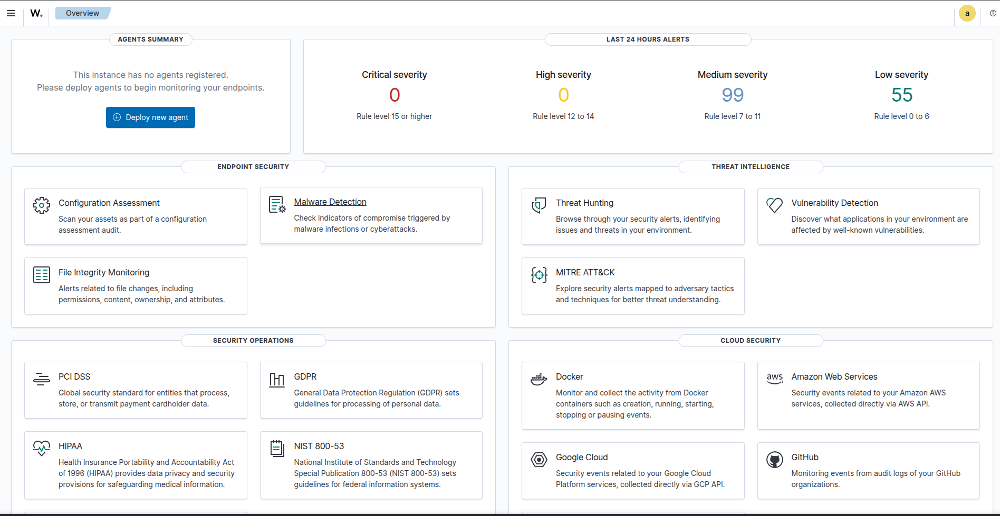
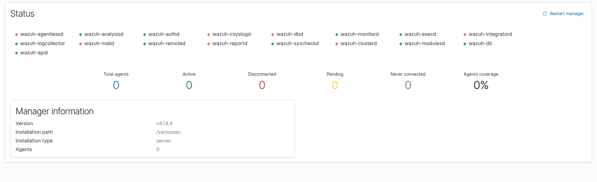
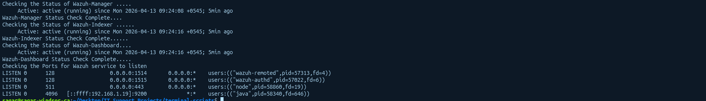
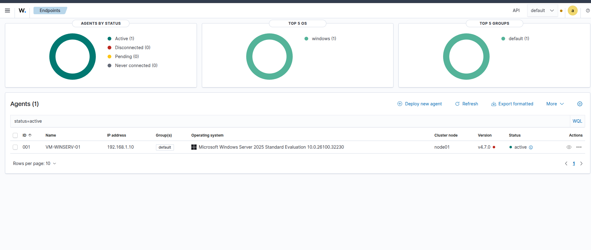
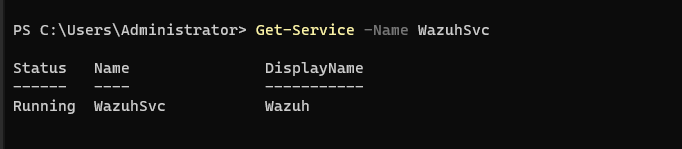
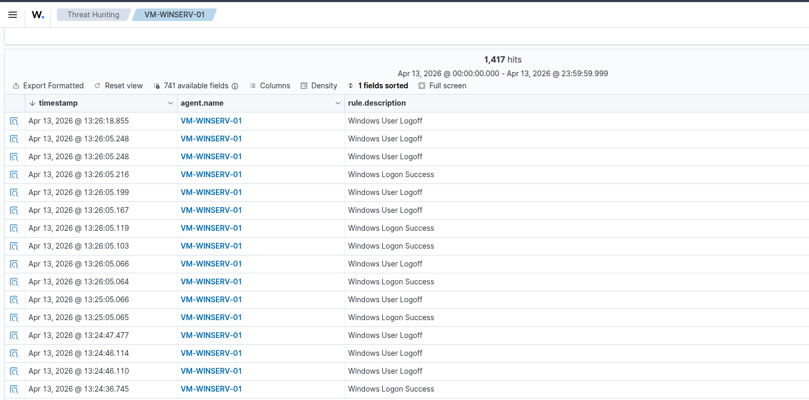
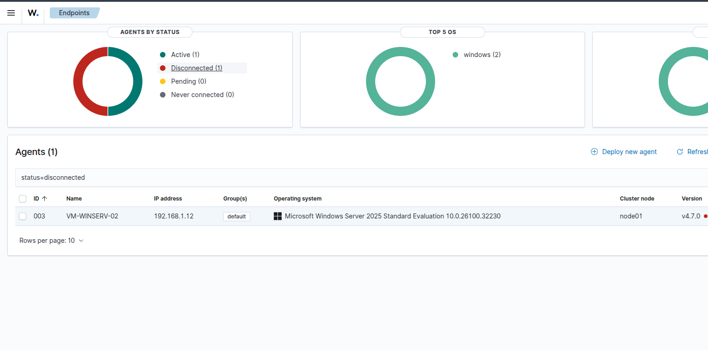

# 🛡️ Wazuh SIEM Lab — Security Monitoring on Windows Server 2025

> A fully operational Security Information and Event Management (SIEM) environment built on Wazuh — deployed on Ubuntu 25, monitoring two Windows Server 2025 Domain Controllers in real time.
> Detects, alerts on, and documents real security events generated by the Active Directory environment from the [AD & Windows Server Labs](https://github.com/your-username/ad-windows-server-labs) project.

<div align="center">


</div>

---

## 📌 Overview

Monitoring an IT environment is just as critical as building it. This project extends the [AD & Windows Server Labs](https://github.com/your-username/ad-windows-server-labs) environment by deploying a full SIEM stack — ingesting Windows Security Event logs from both Domain Controllers, writing custom detection rules for Active Directory threats, and documenting real incident detection cases.

**What this project demonstrates:**

- Deploying and configuring a production-grade SIEM from scratch
- Forwarding and parsing Windows Security Event logs in real time
- Writing custom alert rules for AD-specific threats
- Detecting, investigating, and documenting real security incidents
- The ability to monitor infrastructure proactively — not just react to user complaints

---

## 🖥️ Lab Environment

| Component          | Details                                            |
| ------------------ | -------------------------------------------------- |
| **SIEM Manager**   | Wazuh (Manager + Indexer + Dashboard) on Ubuntu 25 |
| **Ubuntu Host IP** | `192.168.1.xx`                                     |
| **Primary DC**     | `VM-DEV-WINSERV-01` — `192.168.1.10` — Wazuh Agent |
| **Secondary DC**   | `VM-DEV-WINSERV-02` — `192.168.1.12` — Wazuh Agent |
| **Domain**         | `InfoTech.com`                                     |
| **Virtualisation** | VMware Workstation Pro                             |
| **Network**        | Bridged — all machines on `192.168.1.0/24`         |

---

## 🏗️ Architecture

```
┌─────────────────────────────────────────────────┐
│              Ubuntu 25 Host (192.168.1.xx)      │
│                                                 │
│  ┌─────────────────────────────────────────┐   │
│  │           Wazuh Manager                 │   │
│  │      + Indexer (OpenSearch)             │   │
│  │      + Dashboard (Web UI :443)          │   │
│  │                                         │   │
│  │  Port 1514 ← agent events (TCP/UDP)    │   │
│  │  Port 1515 ← agent registration        │   │
│  │  Port  443 → dashboard (HTTPS)         │   │
│  └─────────────────────────────────────────┘   │
└──────────────────┬──────────────────────────────┘
                   │ encrypted traffic
          ┌────────┴────────┐
          ↓                 ↓
┌──────────────────┐  ┌──────────────────┐
│  VM-WINSERV-01   │  │  VM-WINSERV-02   │
│  192.168.1.10    │  │  192.168.1.12    │
│  Wazuh Agent     │  │  Wazuh Agent     │
│                  │  │                  │
│  Forwards:       │  │  Forwards:       │
│  • Security logs │  │  • Security logs │
│  • System logs   │  │  • System logs   │
│  • AD events     │  │  • AD events     │
└──────────────────┘  └──────────────────┘
```

---

## 📁 Repository Structure

```
wazuh-siem-lab/
│
├── config/
│   ├── ossec.conf                   # Wazuh manager main config
│   ├── agent-winserv-01.conf        # Agent config — Server 01  ⏳
│   └── agent-winserv-02.conf        # Agent config — Server 02  ⏳
│
├── rules/
│   ├── custom-ad-rules.xml          # Custom rules — AD events   ⏳
│   └── custom-windows-rules.xml     # Custom rules — Windows     ⏳
│
├── alerts/
│   ├── account-lockout.md           # Detection case — lockout   ⏳
│   ├── failed-logins.md             # Detection case — brute force ⏳
│   └── privilege-escalation.md      # Detection case — group change ⏳
│
├── dashboards/
│   └── screenshots/                 # Wazuh dashboard screenshots ⏳
│
├── docs/
│   └── runbook.md                   # Operational runbook         ⏳
│
└── README.md
```

> ⏳ = In progress — being added as the project develops

---

## 🎯 Security Events Being Monitored

| Event ID | Description                  | Detection Goal                           |
| -------- | ---------------------------- | ---------------------------------------- |
| `4624`   | Successful logon             | Baseline + RDP detection (Logon Type 10) |
| `4625`   | Failed logon                 | Brute-force attack detection             |
| `4740`   | Account locked out           | Lockout alert + automated response       |
| `4767`   | Account unlocked             | Admin action audit trail                 |
| `4720`   | New user account created     | Unauthorised account creation            |
| `4728`   | User added to security group | Privilege escalation detection           |
| `4672`   | Admin privileges assigned    | Sensitive privilege monitoring           |
| `5136`   | AD object modified           | GPO and directory tampering              |

---

## 🧩 Build Progress

| #   | Phase                                | Status      |
| --- | ------------------------------------ | ----------- |
| 1   | Install Wazuh Manager on Ubuntu      | ✅ Complete |
| 2   | Access Wazuh Dashboard in browser    | ✅ Complete |
| 3   | Install Wazuh Agent on VM-WINSERV-01 | ✅ Complete |
| 4   | Install Wazuh Agent on VM-WINSERV-02 | ✅ Complete |


---

---

# ✅ Phase 1 — Installing Wazuh Manager on Ubuntu

## 📋 What Gets Installed

Wazuh is a three-component stack — all three are installed together on the Ubuntu host:

<table>
<tr>
<td width="33%" valign="top">

**🧠 Wazuh Manager**

- The brain of the SIEM
- Receives events from all agents
- Applies detection rules
- Generates and routes alerts
- Ports: `1514` (events), `1515` (registration)

</td>
<td width="33%" valign="top">

**🗄️ Wazuh Indexer**

- Based on OpenSearch
- Stores and indexes all events and alerts
- Powers the search and query engine
- Port: `9200`

</td>
<td width="33%" valign="top">

**📊 Wazuh Dashboard**

- Web-based UI (HTTPS)
- Real-time event visualisation
- Alert management
- Agent status monitoring
- Port: `443`

</td>
</tr>
</table>

---

## ⚙️ Pre-Installation Checks

Confirmed on Ubuntu host before installation:

```bash
# RAM available
free -h

# Disk space available
df -h

# CPU cores
nproc

# Ubuntu version
lsb_release -a

# Connectivity to both Windows Servers
ping -c 2 192.168.1.10
ping -c 2 192.168.1.12
```

### System Resources Confirmed

| Check              | Required        | Result       |
| ------------------ | --------------- | ------------ |
| RAM                | 4 GB minimum    | ✅           |
| Disk               | 20 GB free      | ✅           |
| CPU                | 2 cores minimum | ✅           |
| Ubuntu version     | 22.04+          | ✅ Ubuntu 25 |
| Ping VM-WINSERV-01 | Reachable       | ✅           |
| Ping VM-WINSERV-02 | Reachable       | ✅           |

---

## 📥 Installation Steps

**Step 1 — Download the Wazuh installation assistant**

```bash
curl -sO https://packages.wazuh.com/4.11/wazuh-install.sh
curl -sO https://packages.wazuh.com/4.11/config.yml
```

**Step 2 — Edit the config file with your host details**

```bash
nano config.yml
```

Set the node IPs to your Ubuntu host IP:

```yaml
nodes:
  indexer:
    - name: node-1
      ip: "192.168.1.xx" (Input your host ip address)
  server:
    - name: wazuh-1
      ip: "192.168.1.xx" (Input your host ip address)
  dashboard:
    - name: dashboard
      ip: "192.168.1.xx" (Input your host ip address)
```

**Step 3 — Generate configuration files**

```bash
bash wazuh-install.sh --generate-config-files
```

**Step 4 — Install the Wazuh Indexer**

```bash
bash wazuh-install.sh --wazuh-indexer node-1
```

**Step 5 — Start the Wazuh Indexer cluster**

```bash
bash wazuh-install.sh --start-cluster
```

**Step 6 — Install the Wazuh Server (Manager)**

```bash
bash wazuh-install.sh --wazuh-server wazuh-1
```

**Step 7 — Install the Wazuh Dashboard**

```bash
bash wazuh-install.sh --wazuh-dashboard dashboard
```

**Step 8 — Save the admin credentials**

At the end of installation, Wazuh prints your credentials:

```
INFO: --- Summary ---
INFO: You can access the web interface https://192.168.1.xx
    User: admin
    Password: <auto-generated-password>
```

> ⚠️ **Save this password immediately** — store it somewhere safe. If lost, it requires a full credential reset procedure.

---

## ✅ Verify Installation

```bash
# Check all three services are running
sudo systemctl status wazuh-manager
sudo systemctl status wazuh-indexer
sudo systemctl status wazuh-dashboard

# Confirm manager is listening on the correct ports
sudo ss -tlnp | grep -E "1514|1515|443|9200"
```

**Expected output:**

```
● wazuh-manager.service    Active: active (running)
● wazuh-indexer.service    Active: active (running)
● wazuh-dashboard.service  Active: active (running)
```

---

## 🌐 Access the Dashboard

Open a browser on your Ubuntu desktop and go to:

```
https://192.168.1.xx
```

> Accept the SSL certificate warning — this is expected with a self-signed certificate on a local lab.

Login with:

- **Username:** `admin`
- **Password:** _(saved from Step 8 above)_

You should see the Wazuh Dashboard home screen with **0 agents connected** — agents are added in Phases 3 and 4.

---

## 📸 Screenshots

<p align="center">
  
</p>

---

# ✅ Phase 2 — Access the Wazuh Dashboard

## 📋 What This Phase Covers

With all three Wazuh services running on the Ubuntu host, Phase 2 is about
accessing the web dashboard for the first time, exploring the interface,
and confirming the manager is healthy before connecting any agents.

The Wazuh Dashboard is a full **Security Operations Centre (SOC) interface** —
it's where all alerts, agent status, event timelines, and detection rules are managed.
Understanding the layout before agents are connected makes the rest of the project
much easier to follow.

---

## 🌐 Accessing the Dashboard

Open a browser on **any machine on the `192.168.1.x` network** — Ubuntu desktop,
Windows Server, or even the Windows 11 client — and navigate to:

```
https://192.168.1.xx
```

> **SSL certificate warning is expected.** Wazuh uses a self-signed certificate
> in a lab environment. Click **Advanced → Accept the Risk and Continue**
> (Firefox) or **Advanced → Proceed** (Chrome). This is normal for local lab setups.

**Login credentials:**

| Field    | Value                                                                   |
| -------- | ----------------------------------------------------------------------- |
| Username | `admin`                                                                 |
| Password | Retrieved from `wazuh-install-files/wazuh-passwords.txt` during Phase 1 |

---

## 🗺️ Dashboard Layout — First Login

After logging in you will land on the Wazuh home screen. Here is what each
section means before any agents are connected:

<table>
<tr>
<td width="50%" valign="top">
 
**Left Sidebar — Main Navigation**
| Section | Purpose |
|---------|---------|
| `Overview` | Summary of all security events across all agents |
| `Agents` | List of connected agents and their status |
| `Threat Intelligence` | MITRE ATT&CK mapping and threat hunting |
| `Security Events` | Raw event log browser |
| `Integrity Monitoring` | File integrity change detection |
| `Vulnerabilities` | CVE scan results per agent |
 
</td>
<td width="50%" valign="top">
 
**What to Expect at First Login**
| Item | State |
|------|-------|
| Agents connected | 0 — added in Phases 3 & 4 |
| Security events | 0 — no data yet |
| Manager status | Green — healthy |
| Indexer status | Green — healthy |
| Dashboard version | Wazuh 4.7.x |
 
</td>
</tr>
</table>
 
---
 
## 🔍 Verify Manager Health from the Dashboard
 
Once logged in, navigate to:
 
**☰ Menu → Server Management → Status**
 
Confirm all components show green:
 
```
Component              Status
──────────────────────────────
wazuh-modulesd         ● Running
wazuh-logcollector     ● Running
wazuh-syscheckd        ● Running
wazuh-analysisd        ● Running
wazuh-remoted          ● Running
wazuh-execd            ● Running
wazuh-monitord         ● Running
wazuh-db               ● Running
```
 
> If any component shows **Stopped** — run `sudo systemctl restart wazuh-manager`
> on the Ubuntu terminal and refresh the page.
 
---
 
## 🔍 Verify Manager Health from Terminal
 
Cross-check the dashboard status from the Ubuntu terminal:
 
```bash
# Confirm all three services are still running after reboot
sudo systemctl status wazuh-manager
sudo systemctl status wazuh-indexer
sudo systemctl status wazuh-dashboard
 
# Confirm ports are open and listening
sudo ss -tlnp | grep -E "1514|1515|443|9200"
```
 
**Expected port output:**
 
| Port | Service | Purpose |
|------|---------|---------|
| `1514` | wazuh-remoted | Receives events from agents |
| `1515` | wazuh-authd | Agent registration / authentication |
| `443` | wazuh-dashboard | Web UI — HTTPS |
| `9200` | wazuh-indexer | OpenSearch API |
 
---
 
## 🔒 Enable Auto-Start on Boot
 
Make sure all three Wazuh services start automatically if Ubuntu is rebooted:
 
```bash
sudo systemctl enable wazuh-manager
sudo systemctl enable wazuh-indexer
sudo systemctl enable wazuh-dashboard
```
 
---
 
## ✅ Outcome
 
- Wazuh Dashboard accessible at `https://192.168.1.xx` ✅
- SSL certificate warning accepted — dashboard loaded successfully ✅
- Logged in with `admin` credentials ✅
- All Wazuh Manager components confirmed running in Server Status page ✅
- Ports `1514`, `1515`, `443`, `9200` confirmed listening on Ubuntu ✅
- All three services set to auto-start on boot ✅
- Dashboard shows **0 agents** — ready for Phase 3 (Agent installation) ✅
 
---
 
## 📸 Screenshots
 
<p align="center">
  
  
</p>
 
---
# ✅ Phase 3 — Install Wazuh Agent on VM-WINSERV-01
 
## 📋 What This Phase Covers
 
A Wazuh **agent** is a lightweight service installed on each monitored machine.
It continuously collects security events, log entries, and system activity —
then forwards them encrypted to the Wazuh Manager on Ubuntu.
 
Once the agent is connected, every login attempt, account lockout, group change,
and RDP session on `VM-WINSERV-01` becomes visible in the dashboard in real time.
 
---
 
## 🔍 How Agent Registration Works
 
```
VM-WINSERV-01                          Ubuntu (Wazuh Manager)
──────────────                         ──────────────────────
Agent installed
      │
      │── Registration request ──────► Port 1515 (wazuh-authd)
      │◄─ Unique agent key ────────────
      │
      │══ Encrypted event stream ─────► Port 1514 (wazuh-remoted)
      │                                         │
      │                                         ▼
      │                               Wazuh Indexer stores events
      │                                         │
      │                                         ▼
      │                               Dashboard displays alerts
```
 
---
 
## 🚀 Installation Steps
 
All steps in this phase are run on **VM-WINSERV-01** as Domain Admin,
except the firewall steps which are run on **Ubuntu**.
 
---
 
### Part A — Open Required Ports on Ubuntu Firewall
 
Before installing the agent, make sure the Ubuntu host allows inbound
connections on the ports the agent needs:
 
```bash
# Run on Ubuntu
sudo ufw allow 1514/tcp    # Agent event forwarding
sudo ufw allow 1515/tcp    # Agent registration
sudo ufw enable
sudo ufw status
```
 
**Expected output:**
```
To                Action    From
──                ──────    ────
1514/tcp          ALLOW     Anywhere
1515/tcp          ALLOW     Anywhere
443/tcp           ALLOW     Anywhere
```
 
---
 
### Part B — Download and Install the Agent on VM-WINSERV-01
 
**Step 1 — Open PowerShell as Administrator on VM-WINSERV-01**
 
**Step 2 — Download the Wazuh Windows Agent installer**
 
```powershell
# Download the agent MSI installer
Invoke-WebRequest -Uri "https://packages.wazuh.com/4.x/windows/wazuh-agent-4.7.0-1.msi" `
    -OutFile "C:\wazuh-agent.msi"
```
 
**Step 3 — Install the agent and point it to your Wazuh Manager**
 
```powershell
# Install silently — replace the IP with your Ubuntu host IP
msiexec.exe /i "C:\wazuh-agent.msi" /q `
    WAZUH_MANAGER="192.168.1.xx" `
    WAZUH_AGENT_NAME="VM-WINSERV-01" `
    WAZUH_REGISTRATION_SERVER="192.168.1.xx"
```
 
> **What each parameter does:**
> - `WAZUH_MANAGER` — IP of the Wazuh Manager to forward events to
> - `WAZUH_AGENT_NAME` — How this agent appears in the dashboard
> - `WAZUH_REGISTRATION_SERVER` — Where to register and get the agent key
 
**Step 4 — Start the Wazuh agent service**
 
```powershell
# Start the agent service
NET START WazuhSvc
 
# Confirm it is running
Get-Service -Name WazuhSvc
```
 
**Expected output:**
```
Status   Name        DisplayName
──────   ────        ───────────
Running  WazuhSvc    Wazuh
```
 
**Step 5 — Verify the agent registered successfully**
 
```powershell
# Check the agent log for successful connection
Get-Content "C:\Program Files (x86)\ossec-agent\ossec.log" -Tail 20
```
 
Look for these lines confirming registration and connection:
```
INFO: Successfully registered
INFO: Connected to the server (192.168.1.xx:1514)
```
 
---
 
### Part C — Verify Agent Appears on the Wazuh Dashboard
 
**On the Ubuntu browser**, navigate to:
 
```
https://192.168.1.xx → Agents
```
 
You should see **VM-WINSERV-01** listed with status **Active** (green).
 
---
 
### Part D — Verify from Ubuntu Terminal
 
```bash
# List all registered agents and their status
sudo /var/ossec/bin/agent_control -l
```
 
**Expected output:**
```
ID: 001  Name: VM-WINSERV-01  IP: 192.168.1.10  Status: Active
```
 
---
 
## 🔧 Configure the Agent — Windows Event Log Collection
 
By default the agent collects standard Windows logs. Configure it to also
collect the **Security Event Log** which contains all AD-related events:
 
**On VM-WINSERV-01**, edit the agent config file:
 
```powershell
notepad "C:\Program Files (x86)\ossec-agent\ossec.conf"
```
 
Find the `<localfile>` section and confirm or add the following:
 
```xml
<!-- Security Event Log — AD logins, lockouts, group changes -->
<localfile>
  <location>Security</location>
  <log_format>eventchannel</log_format>
</localfile>
 
<!-- System Event Log -->
<localfile>
  <location>System</location>
  <log_format>eventchannel</log_format>
</localfile>
 
<!-- Application Event Log -->
<localfile>
  <location>Application</location>
  <log_format>eventchannel</log_format>
</localfile>
```
 
**Restart the agent to apply the config:**
 
```powershell
NET STOP WazuhSvc
NET START WazuhSvc
```
 
---
 
## ✅ Outcome
 
- Wazuh agent installed on `VM-WINSERV-01` (`192.168.1.10`) ✅
- Agent registered with Wazuh Manager at `192.168.1.xx` ✅
- `WazuhSvc` service running and confirmed connected ✅
- Agent visible in Wazuh Dashboard as **Active** ✅
- Windows Security, System, and Application event logs configured for collection ✅
- Security events from `VM-WINSERV-01` now flowing into the dashboard ✅
- Ready for **Phase 4 — Agent installation on VM-WINSERV-02** ✅
 
---
 
## 📸 Screenshots
 
<p align="center">
  
   
  />
</p>
 
---
# ✅ Phase 4 — Install Wazuh Agent on VM-WINSERV-02
 
## 📋 What This Phase Covers
 
Phase 4 mirrors Phase 3 exactly — installing and registering the Wazuh agent
on the **secondary Domain Controller** (`VM-DEV-WINSERV-02`).
 
With agents on both DCs, the Wazuh Manager receives security events from the
entire domain — not just one server. This matters because:
 
- **AD replication events** happen on both DCs simultaneously
- **RDP sessions** could be established to either server
- **Authentication failures** against either DC are caught
- If one DC goes offline, the other continues feeding the SIEM
 
> All steps in this phase are identical to Phase 3 — run on
> **VM-DEV-WINSERV-02** (`192.168.1.12`) as Domain Admin.
 
---
 
## 🚀 Installation Steps
 
### Part A — Download and Install the Agent on VM-WINSERV-02
 
**Step 1 — Open PowerShell as Administrator on VM-WINSERV-02**
 
**Step 2 — Download the Wazuh agent installer**
 
```powershell
Invoke-WebRequest -Uri "https://packages.wazuh.com/4.x/windows/wazuh-agent-4.7.0-1.msi" `
    -OutFile "C:\wazuh-agent.msi"
```
 
**Step 3 — Install and register the agent**
 
```powershell
msiexec.exe /i "C:\wazuh-agent.msi" /q `
    WAZUH_MANAGER="192.168.1.xx" `
    WAZUH_AGENT_NAME="VM-WINSERV-02" `
    WAZUH_REGISTRATION_SERVER="192.168.1.xx"
```
 
> Note the agent name is `VM-WINSERV-02` — this is how it appears in the
> dashboard separately from Server 01.
 
**Step 4 — Start the agent service**
 
```powershell
NET START WazuhSvc
 
# Confirm running
Get-Service -Name WazuhSvc
```
 
**Step 5 — Verify connection in the log**
 
```powershell
Get-Content "C:\Program Files (x86)\ossec-agent\ossec.log" -Tail 20
```
 
Look for:
```
INFO: Connected to the server (192.168.1.xx:1514)
```
 
---
 
### Part B — Configure Windows Event Log Collection
 
```powershell
notepad "C:\Program Files (x86)\ossec-agent\ossec.conf"
```
 
Confirm the same `<localfile>` entries are present as on Server 01:
 
```xml
<localfile>
  <location>Security</location>
  <log_format>eventchannel</log_format>
</localfile>
 
<localfile>
  <location>System</location>
  <log_format>eventchannel</log_format>
</localfile>
 
<localfile>
  <location>Application</location>
  <log_format>eventchannel</log_format>
</localfile>
```
 
Restart the agent to apply:
 
```powershell
NET STOP WazuhSvc
NET START WazuhSvc
```
 
---
 
### Part C — Verify Both Agents from Ubuntu Terminal
 
```bash
# List all registered agents — should now show both servers
sudo /var/ossec/bin/agent_control -l
```
 
**Expected output — both agents Active:**
 
```
ID: 001  Name: VM-WINSERV-01  IP: 192.168.1.10  Status: Active
ID: 002  Name: VM-WINSERV-02  IP: 192.168.1.12  Status: Active
```
 
---
 
### Part D — Verify Both Agents on the Dashboard
 
Navigate to `https://192.168.1.xx → Agents`
 
You should now see **two agents** both showing green **Active** status:
 
| Agent ID | Name | IP | Status |
|----------|------|----|--------|
| 001 | VM-WINSERV-01 | 192.168.1.10 | 🟢 Active |
| 002 | VM-WINSERV-02 | 192.168.1.12 | 🟢 Active |
 
---
 
### Part E — Trigger a Test Event to Confirm Data Flow
 
With both agents connected, generate a real Windows Security Event to confirm
events are flowing into the dashboard end to end:
 
**On VM-WINSERV-02**, deliberately fail a login 3 times:
 
```powershell
# This generates Event ID 4625 (failed logon) — visible in Wazuh within seconds
runas /user:InfoTech\FakeUser cmd
# Enter wrong password 3 times — each attempt generates a 4625 event
```
 
**Then check the dashboard:**
 
```
https://192.168.1.xx → ThreatHunting → Search: "4625"
```
 
If you see events appearing from either `VM-WINSERV-01` or `VM-WINSERV-02`
— both agents are working end to end. ✅
 
---
 
## 🔍 Both Agents Connected — What the Dashboard Now Shows
 
With two active agents the Wazuh dashboard provides:
 
<table>
<tr>
<td width="50%" valign="top">
 
**Security Events View**
- Live feed of events from both DCs
- Filter by agent — view Server 01 or Server 02 separately
- Search by Event ID (`4625`, `4740`, `4728` etc.)
- Timeline view showing event frequency over time
 
</td>
<td width="50%" valign="top">
 
**Agent Overview**
- Last keep-alive timestamp per agent
- Event count per agent
- Alert count per agent
- OS and version details
- Agent version and last config sync
 
</td>
</tr>
</table>
 
---
 
## ✅ Outcome
 
- Wazuh agent installed on `VM-DEV-WINSERV-02` (`192.168.1.12`) ✅
- Agent registered with Wazuh Manager at `192.168.1.xx` ✅
- `WazuhSvc` service running and confirmed connected on Server 02 ✅
- Both agents visible in Wazuh Dashboard as **Active** ✅
- Windows Security, System, and Application logs configured on Server 02 ✅
- Test Event ID `4625` confirmed appearing in dashboard from both agents ✅
- **Full domain coverage** — both DCs monitored in real time ✅
- Ready for **Phase 5 — Windows Security Event Log Forwarding Configuration** ✅
 
---
 
## 📸 Screenshots
 
<p align="center">
  
   
  />
</p>
---